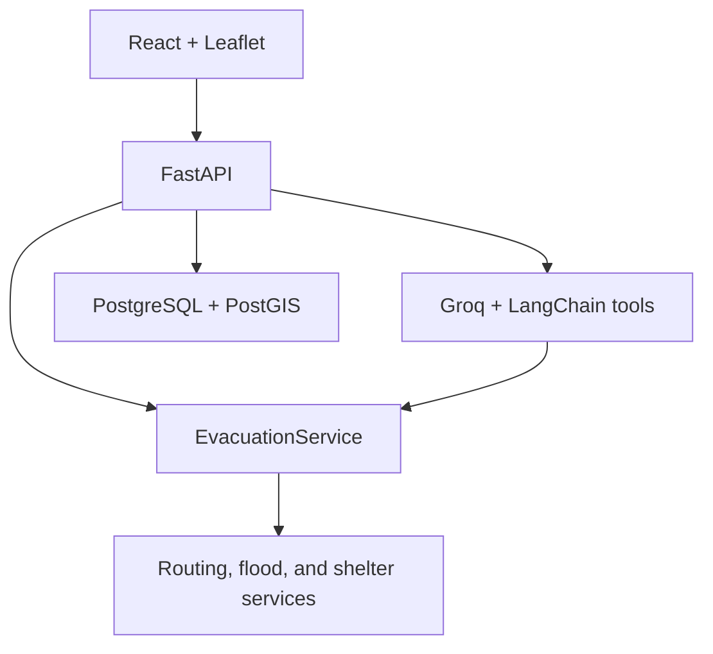
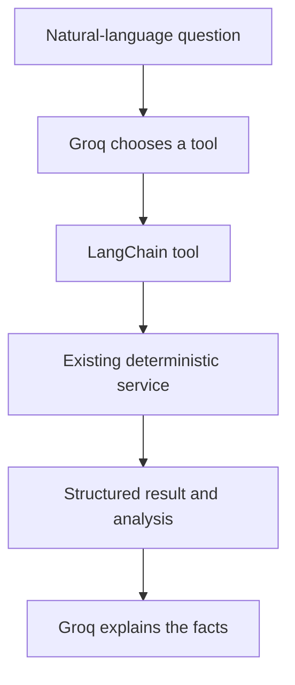

# Disaster Evacuation Route Optimizer

[](https://github.com/venix7/disaster-route-optimizer/actions/workflows/ci.yml)
[](https://disaster-route-optimizer-production.up.railway.app)

**Live demo:** https://disaster-route-optimizer-production.up.railway.app

> Hosted on Railway's free tier — the service sleeps when idle, so the first
> request after a while may take a few extra seconds to wake it up.

A full-stack disaster-aware evacuation system that calculates safer routes on
a Manhattan road network, reacts to simulated flooding, recommends reachable
shelters, and explains deterministic results through a Groq-powered natural
language assistant.

The language model never calculates a route or invents hazard data. It selects
tools, receives structured facts from the existing Python services, and turns
those facts into a readable explanation.

## Contents

- [Routing engine: custom Dijkstra implementation](#routing-engine-custom-dijkstra-implementation)
- [Architecture](#architecture)
- [Main features](#main-features)
- [Deterministic assistant design](#deterministic-assistant-design)
- [Technology stack](#technology-stack)
- [Repository layout](#repository-layout)
- [Environment variables](#environment-variables)
- [Fastest local test: one command](#fastest-local-test-one-command)
- [Separate developer mode](#separate-developer-mode)
- [Standalone routing demo](#standalone-routing-demo)
- [API endpoints](#api-endpoints)
- [Tests and CI](#tests-and-ci)
- [Production deployment](#production-deployment)
- [Operational behavior](#operational-behavior)
- [Security notes](#security-notes)

## Routing engine: custom Dijkstra implementation

[`src/routing/route_engine.py`](src/routing/route_engine.py) hand-implements
Dijkstra's algorithm with a binary heap (`heapq`), run directly on the
`networkx.MultiDiGraph` Manhattan road network. It doesn't minimize raw
distance — it minimizes a per-edge `dynamic_cost` from `CostCalculator`:

```
dynamic_cost = 0.30 × normalized_distance
             + 0.25 × normalized_travel_time
             + 0.10 × traffic_level
             + 0.35 × risk_level
```

Because `risk_level` carries the highest weight, the router willingly trades
extra distance or time for a safer path. It also tracks `(previous_node,
edge_key)` instead of just the previous node, since a `MultiDiGraph` can have
several parallel edges between the same intersections, and it skips any edge
marked `blocked`. Flooding doesn't need a separate "disaster mode" search —
`FloodSimulator` just raises `risk_level` or sets `blocked` on affected roads,
`RoadNetwork` recalculates `dynamic_cost` immediately, and the next
`find_route` call naturally reroutes around it.

Since users click map coordinates rather than graph nodes,
`find_route_by_coordinates` finds the 5 nearest nodes to each click, runs the
search above across up to 25 start/destination combinations, keeps the
cheapest reachable result, and stitches the exact click points onto the ends
of the path. With a binary heap this runs in standard `O((V + E) log V)`
time, fast enough to compute fresh on every request with no caching.

## Architecture



In production, Vite compiles the React application during the Docker build.
FastAPI then serves both the API and the compiled frontend from one container
and one public Railway URL.

## Main features

- Select a start and destination directly on the map.
- Calculate a route with the custom Dijkstra implementation.
- Rank roads using distance, travel time, traffic, and risk.
- Simulate a flood with affected and severe radii.
- Block severe-zone roads and increase risk on affected-zone roads.
- Recalculate routes against the current road-network state.
- Recommend the reachable active shelter with the lowest route cost.
- Store route history and shelter data in PostgreSQL/PostGIS.
- Ask grounded questions about the current route, flood, or shelter.
- Issue natural-language route and shelter commands using selected map points.

## Deterministic assistant design

The assistant has tools for route calculation, shelter recommendation, hazard
status, route explanation, and shelter explanation. Every tool calls the same
services used by the standard dashboard controls, and none of them accept
coordinates from the model directly — they operate only on the start,
destination, and other selections the user already made on the map. This
keeps the model from inventing or guessing locations.



The route cost weights are defined by the existing `CostCalculator`:

| Factor | Weight |
| --- | ---: |
| Distance | 0.30 |
| Travel time | 0.25 |
| Traffic | 0.10 |
| Risk | 0.35 |

## Technology stack

- **Backend:** Python, FastAPI, SQLAlchemy, GeoAlchemy2, psycopg 3
- **Routing:** NetworkX/OSMnx graph data and a custom Dijkstra engine
- **Database:** PostgreSQL with PostGIS
- **Assistant:** LangChain and Groq (`langchain-groq`)
- **Frontend:** React 19, Vite, Axios, Leaflet, React Leaflet
- **Deployment:** Docker, Railway, Neon
- **CI:** GitHub Actions (backend unit tests, frontend lint + build)

## Repository layout

```text
.
├── .github/workflows/ci.yml
├── data/manhattan_graph.graphml
├── frontend/
│   ├── src/components/       # MapView, LocationSelector, AssistantChat, ShelterMarkers
│   ├── src/services/api.js   # Axios client to the FastAPI backend
│   └── package.json
├── src/
│   ├── api/                  # FastAPI app, routes, request/response schemas
│   ├── database/             # SQLAlchemy models, connection, seeding
│   ├── disaster/             # Flood simulation logic
│   ├── graph/                # OSM loading, road network, cost calculator
│   ├── llm/                  # Groq/LangChain assistant service and tools
│   ├── routing/              # Custom Dijkstra route engine
│   ├── services/             # EvacuationService, ShelterService, route analysis
│   └── main.py                # Standalone CLI demo (see below)
├── tests/
├── .dockerignore
├── .env.example
├── DEPLOYMENT.md
├── Dockerfile
├── docker-compose.yml
└── requirements.txt
```

## Environment variables

Copy `.env.example` to `.env` for local development. Never commit `.env`.

| Variable | Required | Purpose |
| --- | --- | --- |
| `DATABASE_URL` | Yes | PostgreSQL connection string. Railway should receive the Neon URL. |
| `GROQ_API_KEY` | For assistant | Backend-only Groq API key. |
| `GROQ_MODEL` | No | Defaults to `openai/gpt-oss-20b`. |
| `GROQ_TIMEOUT_SECONDS` | No | Groq request timeout; defaults to 30 seconds. |
| `ASSISTANT_MAX_TOOL_ROUNDS` | No | Maximum tool-calling rounds; defaults to 4. |
| `DB_CONNECT_TIMEOUT_SECONDS` | No | Database connection timeout; defaults to 10 seconds. |
| `DB_RETRY_ATTEMPTS` | No | Startup connection attempts; defaults to 8. |
| `DB_RETRY_DELAY_SECONDS` | No | Initial retry delay; defaults to 2 seconds. |
| `ALLOWED_ORIGINS` | No | Extra comma-separated origins for split local hosting. |

The backend accepts both `postgresql://` and `postgresql+psycopg://` connection
strings and uses the installed psycopg v3 driver. It enables PostGIS and creates
the required tables during startup.

## Fastest local test: one command

Requirements: Docker Desktop must be running.

1. Create `.env` from `.env.example` and replace the Groq placeholder if you
   want to test the assistant.
2. From the project root, run:

   ```powershell
   docker compose up --build
   ```

3. Open <http://localhost:8000>.

This starts a local PostGIS database and the combined frontend/backend image.
The Compose project generates its own container names, so it does not conflict
with a hard-coded `evacuation_postgres` container. To use different host ports,
put values such as these in `.env`:

```dotenv
APP_PORT=8080
POSTGRES_PORT=5440
```

Then open `http://localhost:8080`. Stop the stack with `Ctrl+C`, followed by
`docker compose down`. The database volume remains available for the next run.

## Separate developer mode

Use this mode when changing React code and you want Vite hot reload.

### 1. Start PostgreSQL/PostGIS

```powershell
docker compose up database -d
```

### 2. Start FastAPI

```powershell
py -m venv venv
venv\Scripts\Activate.ps1
pip install -r requirements.txt
Copy-Item .env.example .env
$env:PYTHONPATH="src"
python -m uvicorn api.main:app --reload
```

Set `GROQ_API_KEY` in `.env` before starting the backend if you want assistant
responses. FastAPI runs at <http://127.0.0.1:8000> and its OpenAPI UI is at
<http://127.0.0.1:8000/docs>.

### 3. Start Vite in another terminal

```powershell
cd frontend
npm ci
npm run dev
```

Vite runs at <http://localhost:5173>. Development requests use the local
FastAPI URL; production requests automatically use the same Railway origin.

## Standalone routing demo

The routing engine, cost calculator, and flood simulator can also be exercised
without the API, database, or frontend. `src/main.py` loads the Manhattan
graph, computes a normal route, simulates a flood centered on that route, then
recomputes and compares the disaster-aware route:

```powershell
$env:PYTHONPATH="src"
python -m main
```

## API endpoints

| Method | Path | Purpose |
| --- | --- | --- |
| `GET` | `/health` | Application and database readiness |
| `GET` | `/network/info` | Road network statistics |
| `POST` | `/route` | Deterministic evacuation route |
| `GET` | `/routes/history` | Recent route calculations |
| `POST` | `/disaster/flood` | Apply flood conditions |
| `POST` | `/disaster/reset` | Reset hazard state |
| `GET` | `/shelters` | Active shelters |
| `POST` | `/shelters` | Create a shelter |
| `POST` | `/evacuation/best-shelter` | Lowest-cost reachable shelter |
| `POST` | `/assistant/chat` | Grounded Groq assistant |

## Tests and CI

Run the small backend suite:

```powershell
$env:PYTHONPATH="src"
python -m unittest discover -s tests -v
```

Run frontend checks:

```powershell
cd frontend
npm ci
npm run lint
npm run build
```

GitHub Actions performs those checks and builds the combined Docker image on
pushes and pull requests to `main`. Railway's GitHub integration can wait for
all checks to pass before automatically deploying that commit.

## Production deployment

The finished production topology is one Railway web service connected to one
Neon PostgreSQL database. There is no separate frontend hosting service and no
Railway database container to wake manually. The live instance is at
<https://disaster-route-optimizer-production.up.railway.app>.

Follow [DEPLOYMENT.md](DEPLOYMENT.md) for the remaining account-level steps:
push to GitHub, create Neon, connect Railway, add two secrets, enable the health
check and Serverless mode, and generate the single public domain.

## Operational behavior

- Startup retries temporary database connection failures with capped
  exponential backoff.
- Database connections have a finite connection timeout and are not retained
  in an application-side idle pool, helping Railway become inactive.
- `/health` returns success only after the routing service is initialized and a
  database query succeeds.
- Railway supplies `PORT`; the container listens on it automatically.
- A sleeping Railway service wakes when its public URL receives a request.
- A cold first request can be slower than normal and may occasionally require a
  browser refresh.

## Security notes

- `GROQ_API_KEY` and `DATABASE_URL` remain backend-only Railway variables.
- Do not create variables beginning with `VITE_` for either secret.
- `.env`, virtual environments, caches, `node_modules`, and compiled frontend
  output are ignored by Git and by the Docker build context.
- The repository includes no production credentials.